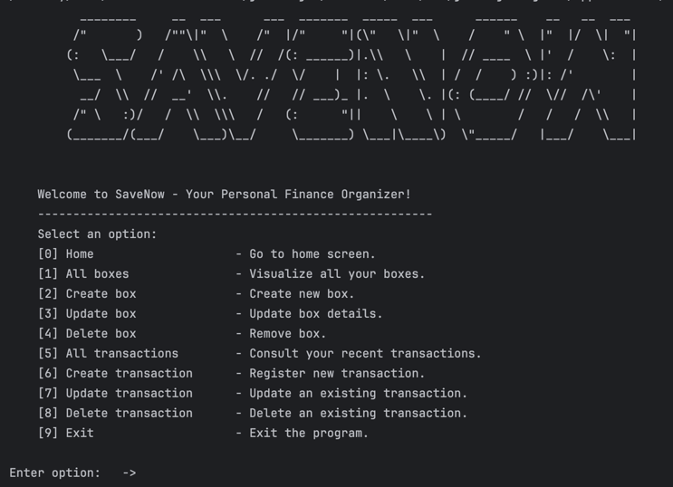
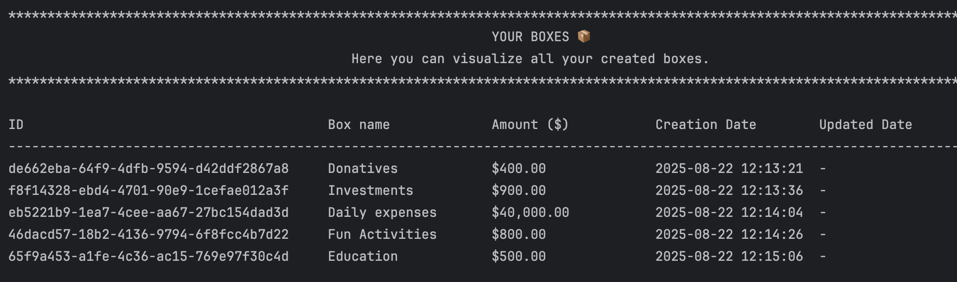
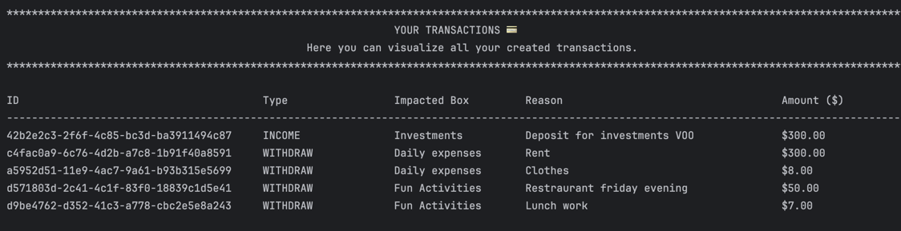
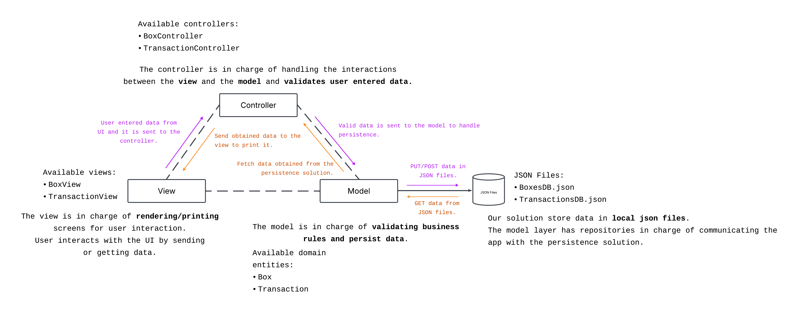
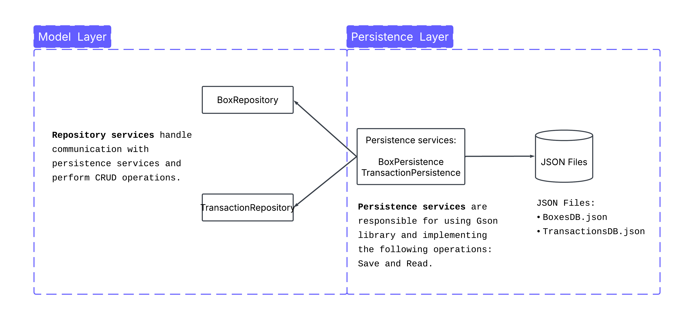
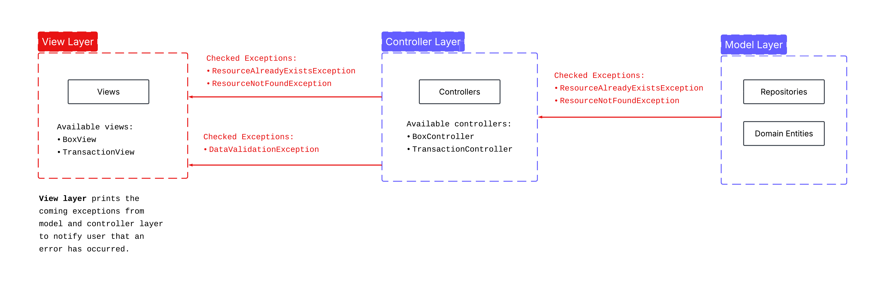

# Save Now Financial App 💵

---

## Table Of Contents 📖

---
- [Context](#context-)
- [Main Features](#main-features-)
- [Technical Details](#technical-details-)
- [Arquitectural Pattern](#arquitectural-pattern-mvc)
- [Persistence Solution](#persistence-solution)
- [Error Handling](#error-handling)

## Context 🌎

---
Save Now is a finance management app designed to make **handling your money simple and stress-free** 💶. 
With an intuitive and **easy-to-use interface**, you can organize your funds into customizable boxes, 
track your expenses 📉 and income 📈, and **categorize every transaction effortlessly** 🤘🏻.

Check out this beautiful user interface !

## Main Features 🔥

---
1. **Box Manager:**
   1. ➡️ Organize your money effortlessly by **creating separate boxes for different purposes**.
   2. ➡️ Whether it's saving for a trip, bills, or daily expenses, you can easily **allocate funds to each box**.
   3. ➡️ This feature helps you stay disciplined and ensures that **your money is always tracked** according to your priorities.
      
       
       
2. **Transaction Tracker**
   1. ➡️ Keep a complete **record of all your financial activities** with ease.
   2. ➡️ Log both outcomes 📉 (expenses) and incomes 📈 (earnings) quickly, categorize them, and **monitor your cash flow**. 
   3. ➡️ With this feature, you can:
      - identify spending patterns 👀,
      - plan your budget more effectively 💵, 
      - make informed financial decisions 📊.
      
   

## Technical Details ✍🏼

---
> Course reference: [DevTalles Java Fundamentals Course](https://www.udemy.com/course/devtalles-java/)

Before diving into the technical details, we should first point out that we have learned many techniques, including several Java techniques, from the training above.

### Arquitectural Pattern MVC
> [Model-View-Controller](https://www.geeksforgeeks.org/software-engineering/mvc-framework-introduction/)

SaveNow financial app was based on the [MVC architectural](https://www.geeksforgeeks.org/software-engineering/mvc-framework-introduction/) pattern adapted to our
needs. It is commonly used in web development, but in our case we adapated it for a **desktop terminal application**.

Each component of the MVC played a crucial role in scaling the application and making the code more readable for everyone by using the [SRP (Single Responsability Principle)](https://stackify.com/solid-design-principles/).

The following diagram illustrates how MVC powered our solution in a clear and visual way:

### Persistence Solution

We could have implemented SQL or NoSQL databases, as there are many persistence solutions out there. 
However, we found the idea of storing our data in JSON files particularly attractive. 
This was made possible thanks to the following library:
> [Google Java Library JSON Manipulation (Gson)](https://mvnrepository.com/artifact/com.google.code.gson/gson)

The library helped us serialize and deserialize Java objects, allowing us to easily work with JSON files! 🙂

This diagram explains in a simplified way how our persistence solution works:

### Error Handling

The proper use of [checked and unchecked exceptions](https://www.geeksforgeeks.org/java/java-checked-vs-unchecked-exceptions/) was key in handling application errors. Part of our codebase uses checked exceptions to 
enforce method-level exception definitions and prevent unhandled errors.

Our view layer is responsible for wrapping code that may throw exceptions in try-catch blocks. All exceptions thrown in the Model and Controller 
layers propagate up to the View layer, which ultimately handles and displays the errors.

The following diagram provides a big-picture view of how we handled exceptions:

