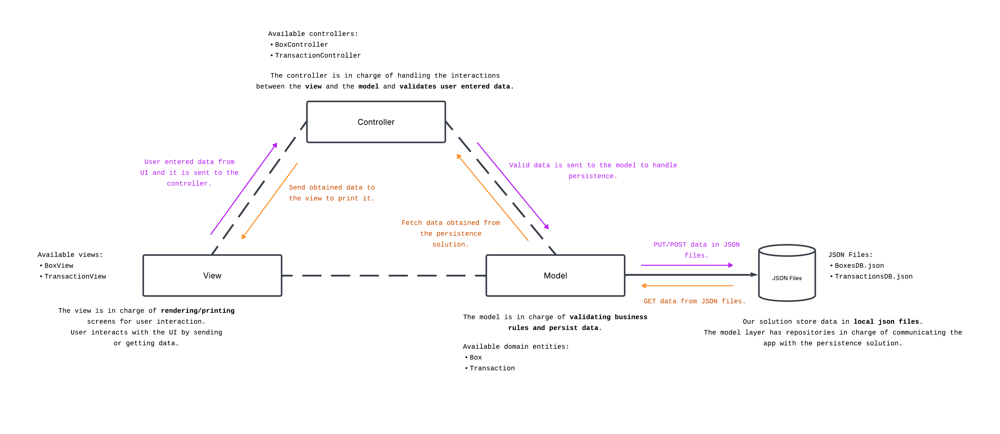
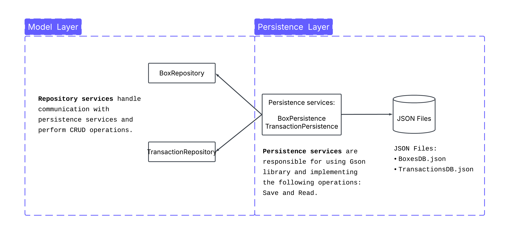

# Save Now Financial App 💵

---

## Table Of Contents 📖

---
- [Context](#context-)
- [Main Features](#main-features-)
- [Technical Details](#technical-details-)
- [Arquitectural Pattern](#arquitectural-pattern-mvc)
- [Persistence Solution](#persistence-solution)

## Context 🌎

---
Save Now is a finance management app designed to make **handling your money simple and stress-free** 💶. 
With an intuitive and **easy-to-use interface**, you can organize your funds into customizable boxes, 
track your expenses 📉 and income 📈, and **categorize every transaction effortlessly** 🤘🏻.

## Main Features 🔥

---
1. **Box Manager:**
   1. ➡️ Organize your money effortlessly by **creating separate boxes for different purposes**.
   2. ➡️ Whether it's saving for a trip, bills, or daily expenses, you can easily **allocate funds to each box**.
   3. ➡️ This feature helps you stay disciplined and ensures that **your money is always tracked** according to your priorities.
      
       
       
2. **Transaction Tracker**
   1. ➡️ Keep a complete **record of all your financial activities** with ease.
   2. ➡️ Log both outcomes 📉 (expenses) and incomes 📈 (earnings) quickly, categorize them, and **monitor your cash flow**. 
   3. ➡️ With this feature, you can:
      - identify spending patterns 👀,
      - plan your budget more effectively 💵, 
      - make informed financial decisions 📊.
      
   

## Technical Details ✍🏼

---
> Course reference: [DevTalles Java Fundamentals Course](https://www.udemy.com/course/devtalles-java/)

Before starting explaining the technical details, we must point we have learned many technics and java technics form the training above. ⬆

### Arquitectural Pattern MVC
> [Model-View-Controller](https://www.geeksforgeeks.org/software-engineering/mvc-framework-introduction/)

SaveNow financial app was based on the [MVC architectural](https://www.geeksforgeeks.org/software-engineering/mvc-framework-introduction/) pattern adapted to our
needs. It is commonly used in web development, but in our case we adapated it for a **desktop terminal application**.

Each component of the MVC was crucial to scale and make the code readable for everyone by using the [SRP (Single Responsability Principle)](https://stackify.com/solid-design-principles/).

The following diagram explains in an ilustrative way how MVC powered our solution:

### Persistence Solution

We could implement SQL or NO-SQL databases, there is many persistence solutions outhere, but we found attracive
the idea of persisting our data in JSON files. Thanks to the following library we made this possible:
> [Google Java Library JSON Manipulation (Gson)](https://mvnrepository.com/artifact/com.google.code.gson/gson)

The library help us serialize and deserialize Java objects and play around with JSON files! 🙂

This diagram explains in a simplifyed way how our persitence solution works:

### Error Handling

Well use of Checked and Unchecked Exceptions were our partner at the moment of controlling application
exceptions. Part of our code base is using Checked Exceptions to enforce method exception definition
and to avoid unhandled exceptions.

Our view layer in charge of envolve in a try catch the pieces of code that are propensed to get any kind of
exception. All Exceptions implemented in Model and Controller layer go up until it reached the View layer
that eventually will print the error.

