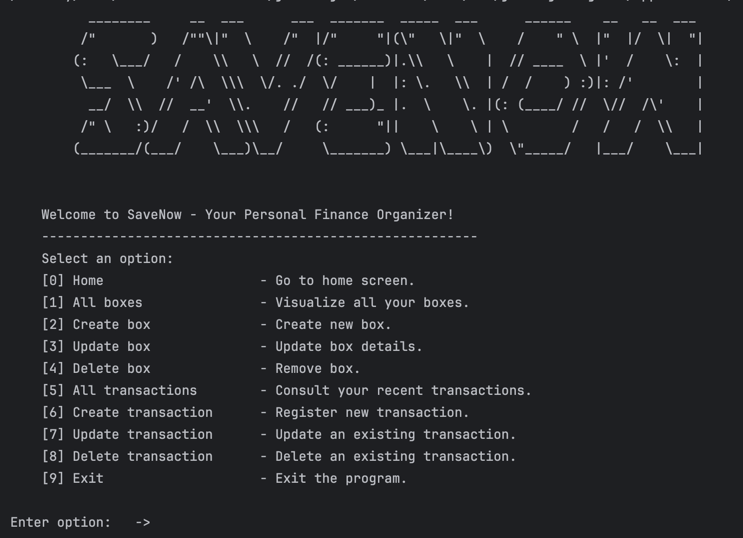
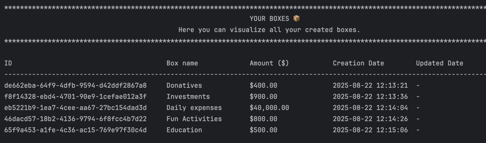
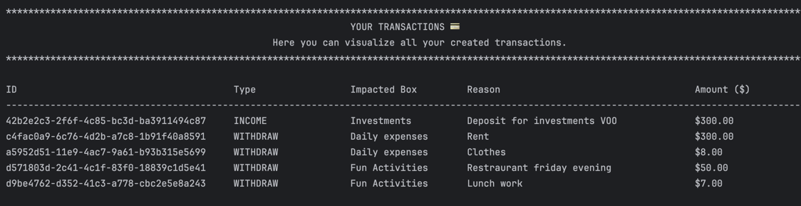

# Save Now Financial App 💵

---
Save Now is a finance management app designed to make **handling your money simple and stress-free** 💶. 
With an intuitive and **easy-to-use interface**, you can organize your funds into customizable boxes, 
track your expenses 📉 and income 📈, and **categorize every transaction effortlessly** 🤘🏻.

## Main Features 🔥

---
1. **Box Manager:**
   1. ➡️ Organize your money effortlessly by **creating separate boxes for different purposes**.
   2. ➡️ Whether it's saving for a trip, bills, or daily expenses, you can easily **allocate funds to each box**.
   3. ➡️ This feature helps you stay disciplined and ensures that **your money is always tracked** according to your priorities.
      
       
       
2. **Transaction Tracker**
   1. ➡️ Keep a complete **record of all your financial activities** with ease.
   2. ➡️ Log both outcomes 📉 (expenses) and incomes 📈 (earnings) quickly, categorize them, and **monitor your cash flow**. 
   3. ➡️ With this feature, you can:
      - identify spending patterns 👀,
      - plan your budget more effectively 💵, 
      - make informed financial decisions 📊.
      
